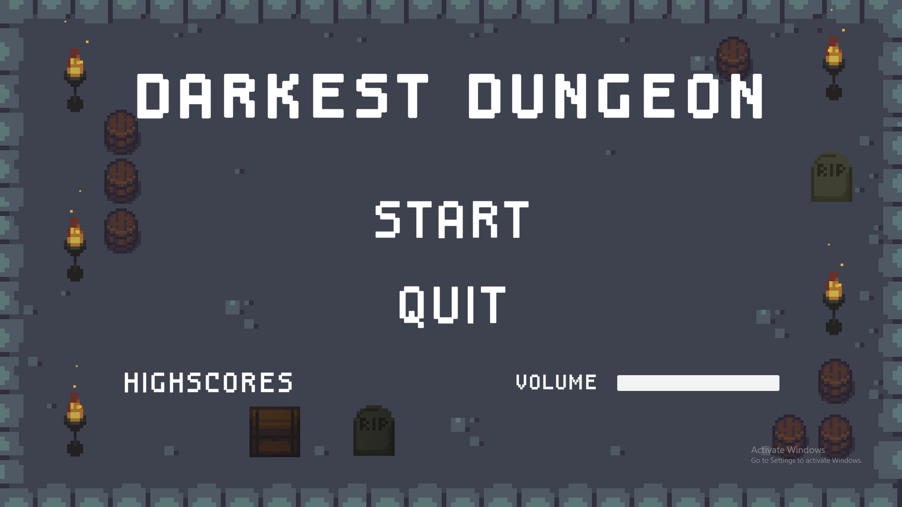
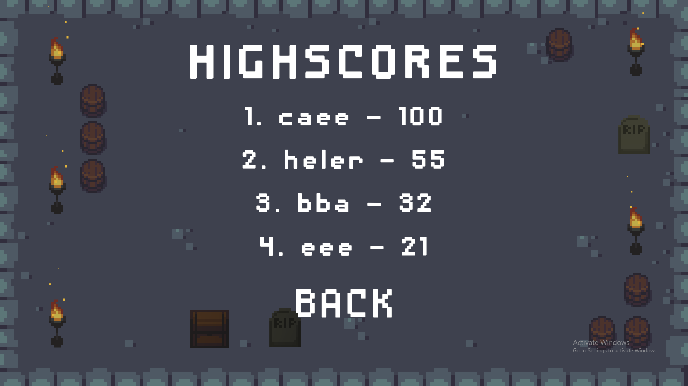
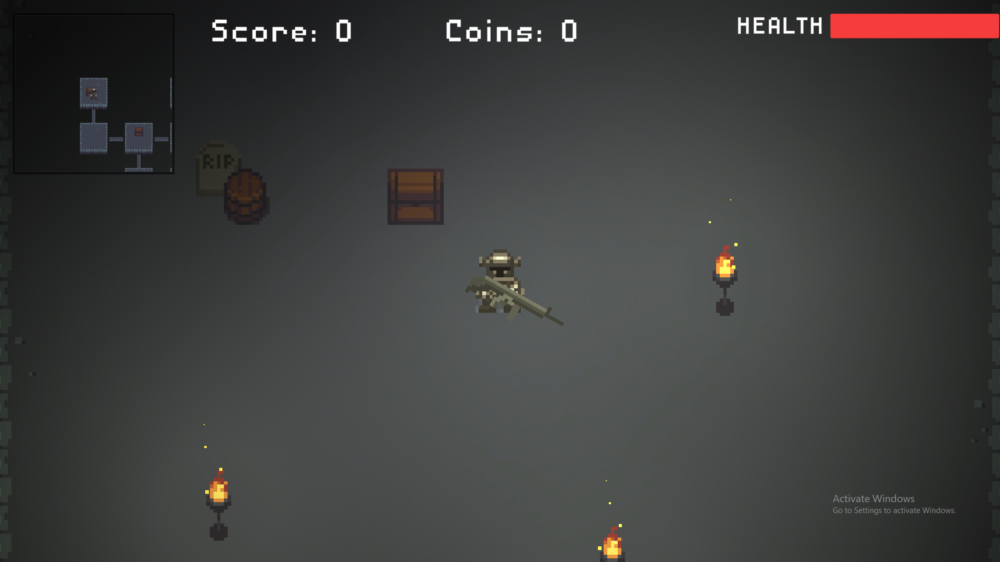
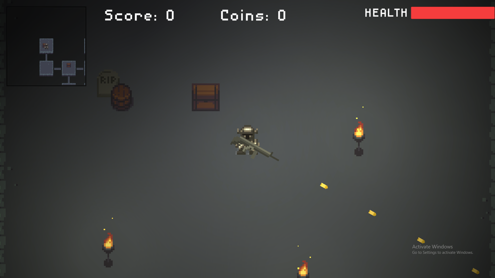

# Altercell

Altercell is a small presonal project game created in Unity game engine.

## About

In this game player goes trough procedurally generated dungeon-like levels. In each level there are couple of keys to be collected to open the doors to the next level. 
If the player gets too close to the monsters they will start hunting, and for every two moves the player makes they can make one. Player can collect and use potions to temporarily increase number of steps before the monsters move.
This game is turn-based, so standing in one spot won't lose you a game, but going around aimlessly can, so plan every step carefully and good luck.

## Running

Executable file is located in bin folder: ``` bin/Altercell.exe ```

## Screenshots






