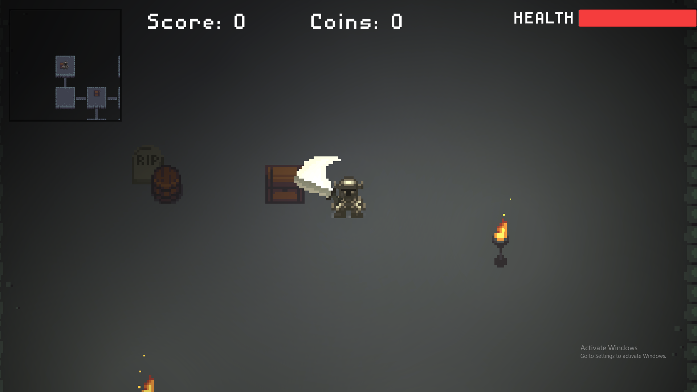
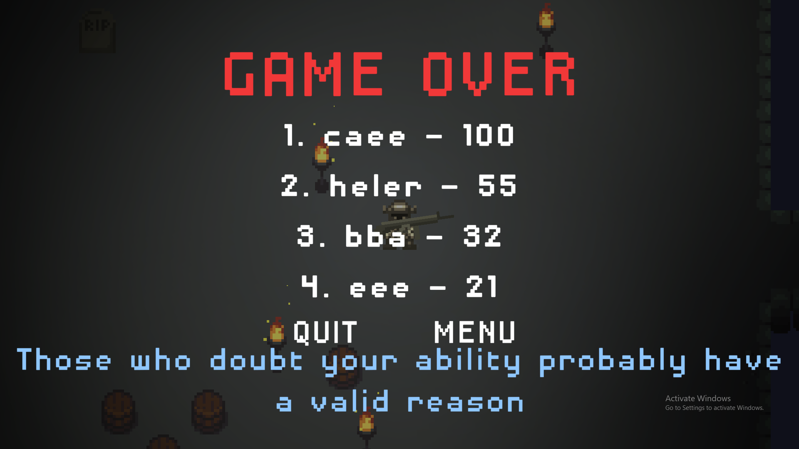

# Darkest Dungeon

This is a small UNFINISHED presonal project game created in Unity game engine. 

## About

In this game the player goes from one proceduraly-generated level to another killing enemies in arcade-like fashion. The goal is getting as many points as possible, while using different pick-ups and weapons (currently enemies are not implemented).
For now player can go around collecting items from barrels on proceduraly generated level. There is also an online highscore database.
This project is "work in progress" so many changes and experiments are still coming.

## Running

Executable file is located in bin folder: ``` bin/Dungeon Game.exe ```

## Screenshots





